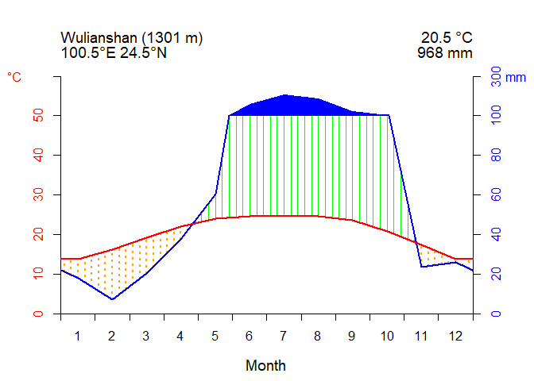

# climplot: Facilitate and tailor Walter & Lieth climatic diagram drawing

<!-- badges: start -->

[](https://lifecycle.r-lib.org/articles/stages.html)
[](https://www.repostatus.org/#active)
[](https://www.gnu.org/licenses/gpl-3.0.en.html)
[](https://cran.r-project.org/)
[](commits/develop)
[](/commits/master)

<!-- badges: end -->


[climplot](https://gitee.com/auman-chan/climplot) aims to collect
crucial climate data for global locations and render the Walter & Lieth
climatic diagrams in a more user-friendly and personalized manner.

The main features of the package are:

- The use of worldwide climate data to obtain standardized and reliable
  data for drawing Walter & Lieth climatic diagrams
- The provision for more parameter to customize the plots and display
  comprehensive information

The package offers functions for:

- Obtain climate data to draw Walter & Lieth Climatic Diagram for global
  locations
- Draw the Walter & Lieth climatic diagram
- Revise the color scheme and information presentation of the diagram

## Installing and loading

To install the latest developmental version from
[github](https://github.com/) and [gitee](https://gitee.com/), you will
need the R packages
[remotes](https://cran.r-project.org/package=remotes) and
[git2r](https://cran.r-project.org/package=git2r). If you want to
install the vignettes of this package, please add
`build_vignettes= TRUE`. \>\>\>\>\>\>\> dev

``` r
install.packages('remotes')

#from github
remotes::install_github("auman-chan/climplot")
#from gitee
install.packages('git2r')
remotes::install_git("https://gitee.com/auman-chan/climplot.git")

#add vignettes
remotes::install_github("auman-chan/climplot",build_vignettes= TRUE)

remotes::install_git("https://gitee.com/auman-chan/climplot.git",
                     build_vignettes= TRUE)
```

## Data preparation

The climate data provided by Worldclim is indispensable, however, due to
its global-scale raster layer format, the file size are substantial and
cannot be accommodated within the package. Therefore, kindly obtain the
climate dataset from [Figshare](NULL) before use.

The dataset comprises of four folders and a total of 48 .tif files,
which include annual average minimum temperature, annual average maximum
temperature, annual average precipitation, and annual extreme minimum
temperature.

## Eaxmple

### Extraction of climate data

Information of the target locations should be ready for the extraction.
The data `locdata` in this package can be a example of the import
data.frame. It must contain five columns in the following order:

- **No**: Serial number of the locations
- **location**: Abbreviation of the locations
- **lon**: Longitude of the locations in decimal digit (negative numbers
  indicating west longitude)
- **lat**: Latitude of the locations in decimal digit (negative numbers
  indicating south latitude)
- **altitude**: Altitude of the locations

Other extra columns with information is allowed behind the columns
above, but would be discarded in following process.

After preparing the climate dataset and location information, import the
data.frame and path of three climate datasets into the function
`clim_extract`:

``` r
#Example data in this package
data("locdata")
#Modify the path of yours
a <- "G:/climplot/climdata/tmin"
b <- "G:/climplot/climdata/tmax"
c <- "G:/climplot/climdata/prec"

#extraction of climate data

plotdata <- clim_extract(locdata, a, b, c)
```

|  No | Altitude | Location   |      Lon |     Lat | Type           |     1 |         2 |     3 |     4 |      5 |      6 |      7 |      8 |      9 |     10 |    11 |    12 |
|----:|---------:|:-----------|---------:|--------:|:---------------|------:|----------:|------:|------:|-------:|-------:|-------:|-------:|-------:|-------:|------:|------:|
|   1 |     2025 | Motuo      |  95.3536 | 29.3042 | precipitation  | 10.10 | 20.960001 | 44.85 | 98.94 | 136.67 | 232.45 | 243.60 | 204.74 | 207.16 |  74.80 |  9.20 |  5.19 |
|   1 |     2025 | Motuo      |  95.3536 | 29.3042 | min.temprature | -1.10 |  0.600000 |  3.70 |  7.20 |  11.20 |  13.70 |  14.90 |  14.60 |  14.10 |   9.90 |  3.70 |  0.60 |
|   1 |     2025 | Motuo      |  95.3536 | 29.3042 | max.temprature | 12.30 | 13.800000 | 16.50 | 19.20 |  22.70 |  25.10 |  25.50 |  26.10 |  24.00 |  20.80 | 17.60 | 14.10 |
|   2 |     1301 | Wulianshan | 100.5000 | 24.5000 | precipitation  | 17.95 |  7.160000 | 20.38 | 37.63 |  60.43 | 158.30 | 203.94 | 187.86 | 120.89 | 103.53 | 23.70 | 26.15 |
|   2 |     1301 | Wulianshan | 100.5000 | 24.5000 | min.temprature |  6.80 |  8.500000 | 11.80 | 15.20 |  18.20 |  20.20 |  20.80 |  20.30 |  19.40 |  16.40 | 11.70 |  8.00 |
|   2 |     1301 | Wulianshan | 100.5000 | 24.5000 | max.temprature | 21.00 | 24.100000 | 26.70 | 29.00 |  30.10 |  29.00 |  28.40 |  29.00 |  27.80 |  25.30 | 23.30 | 19.90 |
|   3 |     2082 | Wawushan   | 102.9167 | 29.5000 | precipitation  |  7.88 |  8.520001 | 24.04 | 59.87 | 100.53 | 195.40 | 180.20 | 164.01 | 163.07 |  62.63 | 15.26 | 11.20 |
|   3 |     2082 | Wawushan   | 102.9167 | 29.5000 | min.temprature | -5.20 | -3.600000 |  0.00 |  4.30 |   7.70 |  10.80 |  13.70 |  13.40 |  10.30 |   5.40 |  1.00 | -3.30 |
|   3 |     2082 | Wawushan   | 102.9167 | 29.5000 | max.temprature |  4.00 |  6.100000 | 10.40 | 14.70 |  17.20 |  18.60 |  21.00 |  21.10 |  16.40 |  12.60 |  9.50 |  5.00 |

The exported data.frame includes 5 kinds of information of locations(as
which in the data.frame imported), and values of 3 kinds of climate
factors across 12 months. A data.frame stores in the data `plotdata` of
this package, as an example of the function export.

### Climatic diagram drawing

Take the data `plotdata` and `plotdata_Frost` as an example, and import
them into the function `clim_plot`:

``` r
data("plotdata")
loc <- subset(plotdata,No==2)
clim_plot(loc)
```



In the figure above:

- The red curve represents the annual variation of temperature, and blue
  one represents of precipitation variation. These two curves form two
  types of patches indicating humidity and aridity levels. The
  string-filled patches represent humid seasons while those with
  scattered points represent arid seasons. The polygon filled with the
  color same as precipitation curve indicates months with precipitation
  over 100mm, displaying the wet season.

- The information on the left top includes the name, the altitude and
  the coordinates of the locations. The right top are the values of
  annual mean temperature and mean precipitation.

## More inforamtion

More examples and information, please view the help pages and [the
websites of this package](https://auman-chan.github.io/climplot/) .

## Reference

1.  Guijarro J A (2023). climatol: Climate Tools (Series Homogenization
    and Derived Products), 4.0.0.,
    <https://CRAN.R-project.org/package=climatol>.

2.  Fick, S.E. and R.J. Hijmans, (2017). WorldClim 2: new 1km spatial
    resolution climate surfaces for global land areas. International
    Journal of Climatology 37 (12): 4302-4315.

3.  Harris, I., Osborn, T.J., Jones, P.D., Lister, D.H. (2020). Version
    4 of the CRU TS monthly high-resolution gridded multivariate climate
    dataset. Scientific Data 7: 109.

4.  Walter H & Lieth H (1960): Klimadiagramm Weltatlas. G. Fischer,
    Jena.
